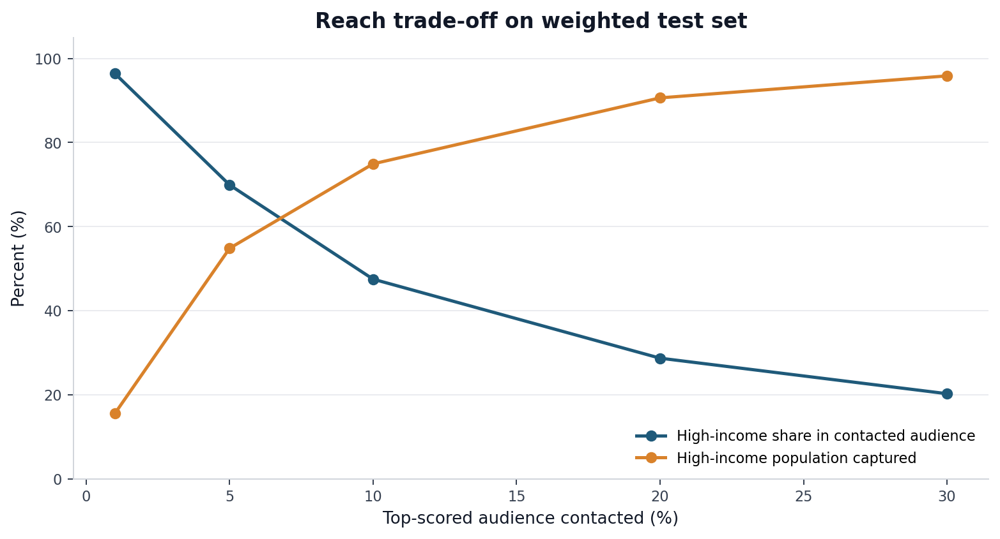
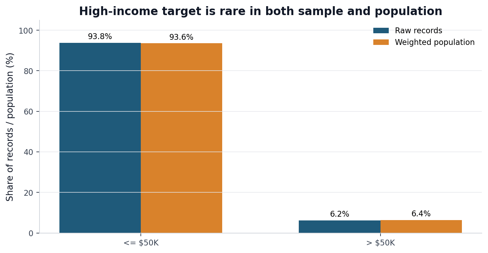
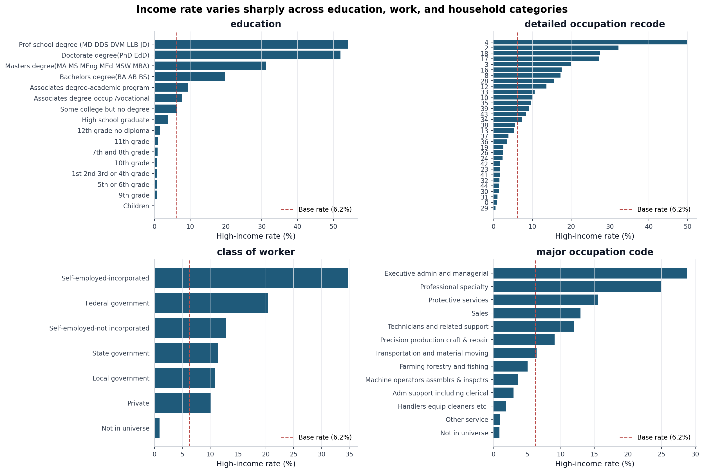
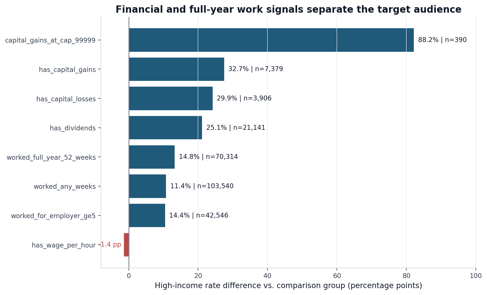
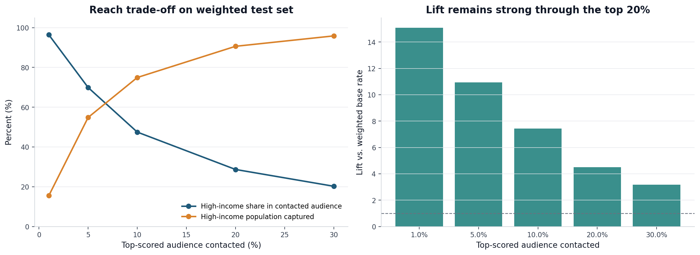
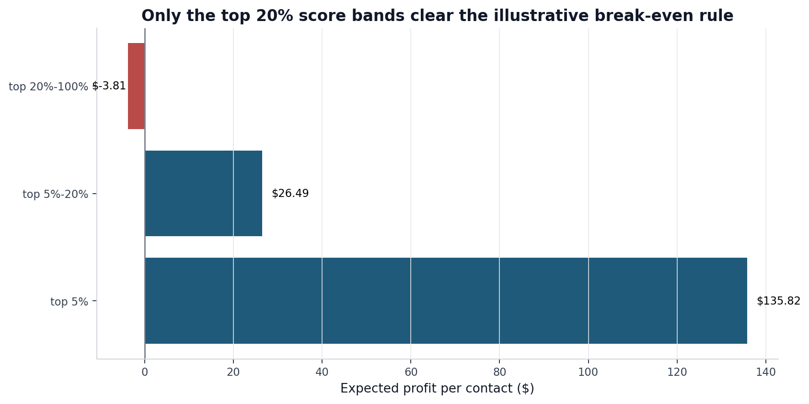
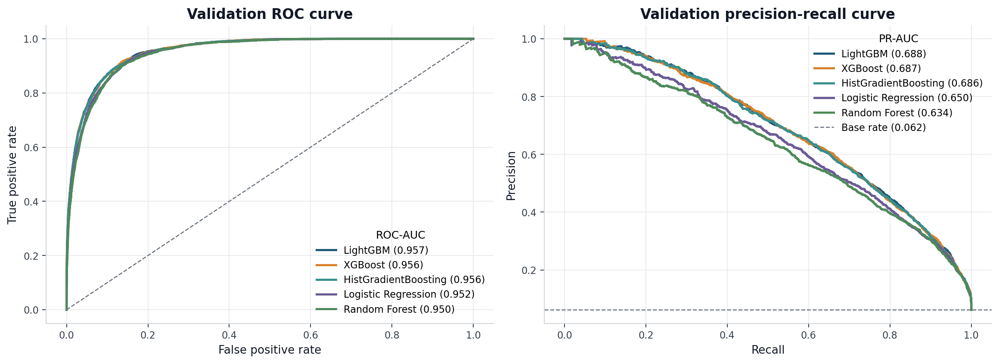
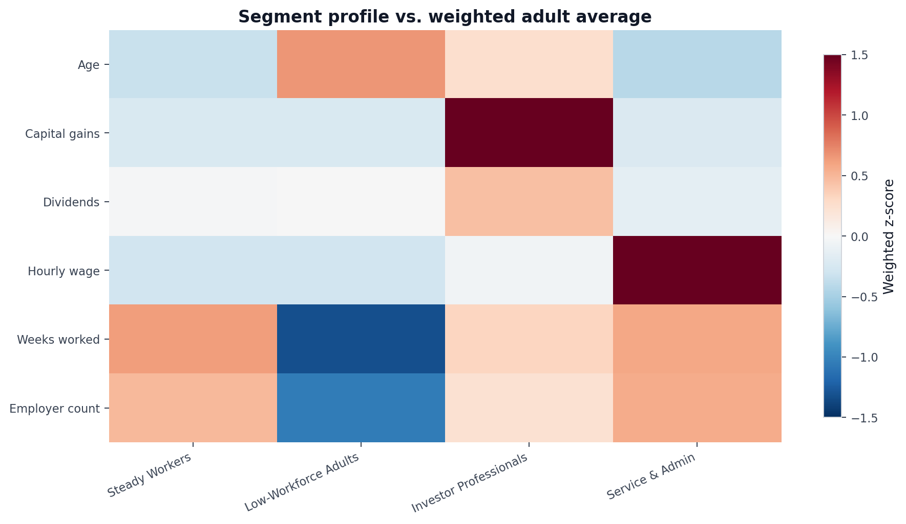
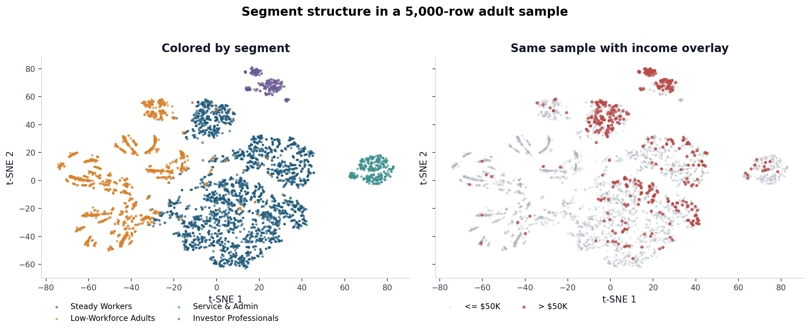
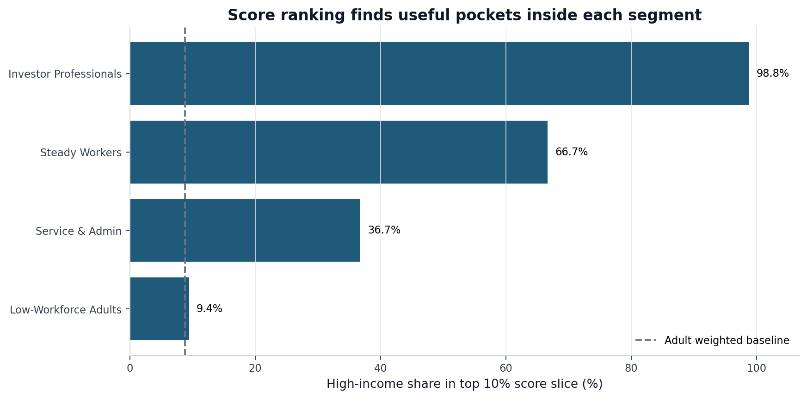

# Retail Income Targeting and Customer Segmentation

## Table of Contents

- [Executive Summary](#1-executive-summary)
- [Recommended Marketing Use](#2-recommended-marketing-use)
- [Deliverables, Methodology, Reliability, and Assumptions](#3-deliverables-methodology-reliability-and-assumptions)
- [Data Exploration and Preprocessing](#4-data-exploration-and-preprocessing)
- [Income Differentiation: Classification](#5-income-differentiation-classification)
- [Customer Segmentation](#6-customer-segmentation)
- [Limitations and Suggestions for This Project](#7-limitations-and-suggestions-for-this-project)

## 1. Executive Summary

This project aims to give the retail marketing team two tools:

1. A **ranked income score** that estimates how likely each prospect is to earn more than $50,000. This is a ranking tool, not a fixed yes/no label.
2. An **adult customer segmentation** that groups similar audiences for campaign planning. The segmentation is adult-only because work, income, and household-role patterns are not comparable for children.

The score helps decide **which audiences to prioritize for high-income-oriented campaigns**. The segments help marketing understand **who those audiences are, where the opportunity sits, and how messaging should differ by group**.

**Recommendation for Marketing Campaign**: Use the score to choose the reach/precision trade-off: smaller top-score bands for high-cost or premium campaigns, and broader top 10%-20% bands when the goal is wider high-income coverage. The strongest marketing play is to combine both outputs: use segments for message strategy, then use the score within each segment to control who gets contacted (More details are provided in the [next section](#2-recommended-marketing-use)).

## 2. Recommended Marketing Use

**The classification model.**
Different campaign types, budgets, and channel costs call for different reach strategies. The score curve is meant to help marketing choose that trade-off:

- **Precision-oriented targeting:** when contact cost is high or the campaign needs the highest-confidence audience, use the blue line to choose a smaller top band. For example, the top 5% has about **70%** above $50,000 on the weighted test set.
- **Coverage-oriented targeting:** when the campaign needs broader reach, use the orange line to understand how much of the high-income population is captured. For example, the top 20% captures about **90%** of the weighted high-income population while still running at **4.5x** lift.

The table below gives common score-band choices so marketing can compare audience size, precision, and captured opportunity side by side.

| Score-ranked audience | % above $50K | Lift vs. population | % of weighted >$50K population captured |
| --------------------- | -----------: | ------------------: | --------------------------------------: |
| Top 1%                |       96.40% |              15.10x |                                  15.51% |
| Top 5%                |       69.89% |              10.95x |                                  54.83% |
| Top 10%               |       47.48% |               7.44x |                                  74.91% |
| Top 20%               |       28.68% |               4.49x |                                  90.61% |
| Top 30%               |       20.23% |               3.17x |                                  95.84% |

> _Note: Lift compares the high-income rate in a selected score band with the overall weighted high-income rate: `lift = score-band high-income rate / overall weighted high-income rate`. For example, top 5% lift of 10.95x means the top-scored 5% is about 10.95 times as concentrated with >$50K individuals as the overall population._

**The segments.** Use the segmentation for **message planning**, and use the classifier score for **audience prioritization inside each segment**. In practice, marketing can first choose the segment that fits the campaign message, then choose the score band that fits the budget and contact strategy.

- **Investor Professionals**: best starting point for premium or investment-oriented messaging because it is the most income-dense segment.
- **Steady Workers**: the largest scalable audience; use the classifier score to find the strongest high-income pockets within it.
- **Service & Admin**: smaller segment where high-income prospects are less common, so score filtering is especially important.
- **Low-Workforce Adults**: better suited for value, convenience, or non-income-led campaigns than for high-income targeting.

**Classification + Segmentation.** The most actionable use is to combine both tools: pick a segment for message fit, then apply the score cutoff for reach control.

| Recommended audience                   |  Weighted reach | % above $50K | Suggested use                                 |
| -------------------------------------- | --------------: | -----------: | --------------------------------------------- |
| Investor Professionals × top 5% score  | 0.26% of adults |       99.19% | Small, highest-confidence premium audience.   |
| Investor Professionals × top 20% score | 1.03% of adults |       96.61% | Premium audience with slightly broader reach. |
| Steady Workers × top 5% score          | 2.82% of adults |       82.86% | Best scalable premium audience.               |
| Steady Workers × top 10% score         | 5.66% of adults |       66.67% | Broader digital or loyalty audience.          |

## 3. Deliverables, Methodology, Reliability, and Assumptions

### 3.1 What We Delivered

This analysis produces two connected outputs:

1. A **classification model** that estimates each person's likelihood of earning more than $50,000 using demographic, employment, household, and financial variables recorded in 1994-95.

2. A **segmentation model** that groups adults into four interpretable audiences for campaign planning. These segments are chosen for structure and actionability, not just for income separation.

| Segment                | Weighted size | In-segment >$50K | Primary cluster profile                                                         |
| ---------------------- | ------------: | ---------------: | ------------------------------------------------------------------------------- |
| Steady Workers         |        56.32% |           11.30% | Broad full-year working base with steady labor-force attachment.                |
| Low-Workforce Adults   |        31.18% |            1.24% | Lower weeks worked, lower employer count, and limited financial-income signals. |
| Service & Admin        |         7.47% |            4.52% | Service/admin occupational mix with weaker investment-income signals.           |
| Investor Professionals |         5.03% |           33.47% | Professional profile with stronger capital-gain and dividend signals.           |

### 3.2 How We Produced It

**The classification model.**

- **Training:** We trained five common classifier families: `Logistic Regression`, `Random Forest`, `HistGradientBoosting`, `XGBoost`, and `LightGBM`.
- **Validation:** We used the validation set to choose the model family and feature set. PR-AUC was the primary selection metric because the target is rare and the business problem is ranked targeting. Weighted metrics and top-band lift were used as business checks. Sample weights were used for validation/test reporting and audience sizing, not for model training.
- **Decision:** The selected model is **HistGradientBoosting**. LightGBM had the highest validation PR-AUC, but the gap was only **0.0022** versus HistGradientBoosting. We chose HistGradientBoosting because it was simpler to reproduce, stayed inside scikit-learn, and the marginal PR-AUC gain was not business-material.

**The segments.**

- **Universe:** We built segmentation on adults only. Children and minors were excluded because their income, work, and household-role patterns are structurally different from adult customers.
- **Features:** We used work, education, household, and financial-profile fields. Income was measured after clustering rather than used to form the clusters.
- **Preprocessing:** Numerical features were standardized, and categorical features were one-hot encoded.
- **Dimensionality reduction:** The resulting 58-column sparse matrix was reduced to 20 dimensions with TruncatedSVD before clustering. This makes K-Means distance comparisons more stable in a sparse feature space.
- **Decision:** The final segmentation uses **K-Means with K = 4**. K=4 was selected because it produced interpretable, deployable segments, met the 5% minimum weighted-size activation floor, and had the best deployable structural score among the candidate models.

### 3.3 How Reliable It Is

Reliability is measured in three ways: held-out test performance for the classifier, weighted and unweighted metrics to compare sample-level and population-level results, and stability checks for both the final classifier and segmentation.

**Held-out test performance on weighted and unweighted metrics.** On the held-out test set, the final classifier achieved:

| Metric      | Unweighted test | Weighted test | Business reading                                                                        |
| ----------- | --------------: | ------------: | --------------------------------------------------------------------------------------- |
| PR-AUC      |          0.6738 |        0.6791 | Strong ranking performance for a rare target.                                           |
| ROC-AUC     |          0.9516 |        0.9510 | Strong separation between high- and lower-income records.                               |
| Brier score |          0.0325 |        0.0332 | Scores are directionally useful, but not treated as perfectly calibrated probabilities. |

> _Note: Unweighted metrics describe performance on the sample rows. Weighted metrics estimate performance for the represented population using Census sample weights._

**Stability checks.** The classifier was also checked with 5-fold cross-validation on the training split. The top-10% weighted precision was stable at **47.33% +/- 0.94 percentage points**, and top-10% lift was **7.41x +/- 0.12x**.

The segmentation was stable under three checks: subsample refit ARI **0.9997**, sensitive-attribute inclusion ARI **0.9884**, and expanded-feature ARI **0.9463**. In plain terms, the same broad segments reappeared even when the clustering inputs were stressed.

### 3.4 Key Assumptions

The recommendations depend on a few assumptions we have:

- **A1: Ranking is more useful than a binary label.** Marketing teams usually need to choose how deep into an audience to go based on budget, channel cost, and expected return. A score supports top 5%, 10%, or 20% targeting; a fixed label hides that flexibility.
- **A2: Segmentation should focus on adults.** Children and minors have structurally different income, work, and household-role patterns. Including them in customer segmentation would create groups that are less useful for adult retail campaign planning.
- **A3: The primary use case is high-income-oriented targeting.** The score is designed to prioritize likely high-income prospects. If the business wants a lower-income, value-oriented, or mass-market audience, it should use lower score bands.
- **A4: Sensitive attributes need a production decision.** The technical classifier includes sensitive demographic fields such as sex, race, hispanic origin, and citizenship. Before deployment, the client should decide whether these fields are allowed and appropriate for the campaign, then audit the selected audience.
- **A5: The data vintage limits direct deployment.** The model is trained on 1994-95 survey data. The patterns are useful for this project, but current deployment would require retraining on current customer or market data.
- **A6: Segments are chosen for actionability, not pure income separation.** Income is measured after clustering. That keeps the segments useful for audience understanding and message planning instead of forcing every segment to be an income bucket.
- **A7: Sample weights are used for evaluation and sizing, not training.** The model is trained on raw sample rows for stability. Census sample weights are used when reporting population-level metrics, audience size, and lift.

---

## 4. Data Exploration and Preprocessing

> _Detailed analysis: `notebooks/01_eda.ipynb`._

### 4.1 Dataset at a Glance

The dataset contains **199,523 individual records** from the Census Bureau's 1994-95 Current Population Survey extract. Each person has survey attributes covering income, education, work, household role, demographics, migration fields, and a sample weight.

Weighted up to the represented population, the file covers about **347 million person-records** across the two survey years. About **22.2 million** of those weighted person-records, or **6.4%**, are above the $50,000 income threshold.

The target is rare, but the weighted and unweighted rates are close. That is useful: the sample imbalance reflects the represented population rather than a sampling accident. It also means the modeling work should focus on ranking, lift, and top-band precision rather than raw accuracy.

### 4.2 What Separates High-Income Records

The clearest single-variable signals come from education, occupation, full-year work, and investment-income fields. These findings guided the feature engineering used later in classification and segmentation.

| EDA insight                                                                | Modeling implication                                                                      |
| -------------------------------------------------------------------------- | ----------------------------------------------------------------------------------------- |
| Education has a strong gradient across degree levels.                      | Keep granular education and allow grouped degree features in simpler models.              |
| Occupation and worker class identify labor-market position.                | Retain broad occupation and worker-class fields for both classification and segmentation. |
| Capital gains, dividends, and capital losses are strong financial signals. | Add flags/log transforms and preserve the capital-gain top-code indicator.                |
| Full-year work is strongly related to high-income status.                  | Use weeks worked and work-status fields as core labor-attachment features.                |

**Education is a broad signal.** The high-income rate rises steadily with attainment: about **20%** for bachelor's degrees, **31%** for master's degrees, **52%** for doctorates, and **54%** for professional degrees. Bachelor's-or-above as a group has a **25.7%** high-income rate, compared with **2.8%** for everyone else.

**Occupation and worker class add labor-market context.** Executive/managerial roles are **28.8%** high-income, and professional specialty roles are **24.9%**. Self-employed incorporated workers are **34.7%** high-income, compared with **12.9%** for self-employed workers who are not incorporated.

**Financial fields are especially powerful.** Any reported capital gains moves the high-income rate from **5.2%** to **32.7%**. Dividends move it from **4.0%** to **25.1%**. Capital losses show a similar pattern. The strongest flag is the survey top-code for capital gains: among records at the $99,999 reporting cap, **88.2%** are above $50,000.

**Full-year work helps distinguish stable earning capacity.** People who worked all 52 weeks are high-income at **14.8%**, compared with **1.5%** for people who worked fewer weeks. The high-income group is not just more educated; it is also more likely to be fully attached to the labor force.

Demographics and household context have signal too. Married-civilian-spouse-present, householder, male, and joint tax filer all have above-baseline high-income rates. These are weaker than the education/work/financial signals, but they help the model distinguish otherwise similar records.

### 4.3 Data Quality Findings & Decisions

The main data quality findings and modeling treatments were:

| Pattern found in EDA                                                                    | Why it matters                                                                       | Treatment                                                                   |
| --------------------------------------------------------------------------------------- | ------------------------------------------------------------------------------------ | --------------------------------------------------------------------------- |
| Many categorical columns contain `"Not in universe"`.                                   | This usually means the survey question did not apply, not that the value is missing. | Keep it as its own category.                                                |
| Four migration fields are empty for 1995 and populated for 1994.                        | They encode survey-year structure more than migration behavior.                      | Drop them before modeling.                                                  |
| Some country-of-birth fields use `?`; `hispanic origin` has small "Do not know" groups. | These are unknown responses, not values we can safely infer.                         | Collapse to `"Unknown"`.                                                    |
| Several fields have detailed and broad versions.                                        | Keeping both can add redundancy.                                                     | Test them through feature ablation and expanded-feature sensitivity checks. |

---

## 5. Income Differentiation: Classification

> _Detailed analysis: `notebooks/02_classification.ipynb`._

The classification notebook turns the EDA findings into a ranked high-income propensity model. It compares common classifier families, selects a final model on validation data, checks stability with cross-validation, and evaluates the selected model once on a held-out test set. For marketing, the main output is not a yes/no label. It is a ranked list that can be cut into top 5%, 10%, or 20% audiences depending on campaign strategy.

### 5.1 What the Classifier Produces

The classifier produces a **high-income propensity score** for each record. A higher score means the person should be prioritized earlier **when the campaign goal is to reach high-income prospects**. The score is not meant to be a permanent yes/no label; it is a ranking that marketing can cut at different depths depending on the campaign.

The recommended workflow is:

1. Score the eligible audience.
2. Sort from highest to lowest high-income propensity.
3. Choose a top band based on the campaign's precision-vs.-coverage need.
4. Track response by score band so future thresholds can use real campaign results.

This is more useful than a fixed label because the right cutoff changes by campaign. A high-touch campaign may only want the top 5%, where precision is highest. A broader campaign may use the top 10%-20%, where more of the high-income population is captured.

### 5.2 Recommended Score Bands

Score bands should be chosen by balancing precision, reach, and campaign economics. The model bundle saves validation-derived score thresholds for common bands so marketing can apply the same ranking logic consistently.

The net-value calculation is:

`expected net value per contact = band precision x expected value per contacted high-income prospect - contact cost`

A score band clears break-even when:

`band precision >= contact cost / expected value per contacted high-income prospect`

The notebook uses a simple example to show the calculation:

- Cost per contact: **$5**
- Expected value per contacted high-income prospect: **$200**
- Break-even precision: **2.5%**

The final validation-derived bands saved in the model bundle are:

| Band         | Minimum score | Validation precision | Lift vs. base rate | Example net value/contact |
| ------------ | ------------: | -------------------: | -----------------: | ------------------------: |
| Top 5%       |        0.3998 |               70.41% |             10.86x |                   $135.82 |
| Top 5%-20%   |        0.0461 |               15.75% |              2.43x |                    $26.49 |
| Top 20%-100% |        0.0000 |                0.60% |              0.09x |                    -$3.81 |

In this example, both the top 5% and the incremental 5%-20% band clear break-even. That makes **top 20% by score** a reasonable starting band when the campaign wants broad high-income coverage, with a validation minimum score of **0.0461**. The **top 5%** remains the better operating choice when the campaign is expensive, capacity-limited, or focused on the highest-confidence audience.

For a live campaign, the same table should be recalculated with the real contact cost, expected value, conversion goal, and audience-size constraint.

### 5.3 Model Selection and Comparison

Five common model families were benchmarked on the validation set. The goal was to pick a strong, reproducible ranking model, not to optimize every model family exhaustively.

| Model                | Feature encoding                     | Validation PR-AUC | Weighted PR-AUC |    ROC-AUC |      Brier |
| -------------------- | ------------------------------------ | ----------------: | --------------: | ---------: | ---------: |
| LightGBM             | Native categorical                   |        **0.6883** |          0.6978 | **0.9566** | **0.0318** |
| XGBoost              | Native categorical                   |            0.6874 |      **0.6983** |     0.9563 |     0.0319 |
| HistGradientBoosting | Ordinal categorical                  |            0.6861 |          0.6962 |     0.9558 |     0.0319 |
| Logistic Regression  | One-hot / engineered linear features |            0.6496 |          0.6597 |     0.9516 |     0.0339 |
| Random Forest        | One-hot                              |            0.6344 |          0.6448 |     0.9499 |     0.0368 |

> _Note: Feature encoding describes how the model received categorical fields. One-hot encoding turns each category into binary indicator columns. Ordinal categorical encoding maps categories to integer codes inside the pipeline. Native categorical means the model library handles categorical splits directly._

LightGBM, XGBoost, and HistGradientBoosting are separated by only **0.0022 validation PR-AUC**. All three beat Logistic Regression and Random Forest by a clear margin. Given that near-tie, **HistGradientBoosting** was selected because it is simpler to reproduce and close enough that the difference is not business-material.

### 5.4 Validation Strategy

The modeling workflow used:

- A fixed **60 / 20 / 20 train / validation / test split**.
- The validation set for model-family selection, feature ablation, and threshold planning.
- A final untouched test set for the reported holdout performance.
- A **5-fold stratified cross-validation check on the training split** for the selected feature set.
- No grid search, random search, or CV-based hyperparameter tuning.

PR-AUC was the primary model-selection metric because the target is rare and the business use case is ranked targeting. The cross-validation check was added after model selection to confirm stability, not to tune hyperparameters.

| CV metric                  |   Mean | Std. dev. | Reading                                                              |
| -------------------------- | -----: | --------: | -------------------------------------------------------------------- |
| PR-AUC                     | 0.6665 |    0.0134 | Ranking quality is stable across folds.                              |
| Weighted PR-AUC            | 0.6713 |    0.0129 | Weighted and unweighted results are similar.                         |
| ROC-AUC                    | 0.9515 |    0.0024 | Class separation is very stable.                                     |
| Weighted ROC-AUC           | 0.9512 |    0.0023 | Weighted separation is equally stable.                               |
| Brier score                | 0.0329 |    0.0007 | Numerically stable, but not a full calibration audit.                |
| Top-10% weighted precision | 47.33% |   0.94 pp | The top decile repeatedly contains about half high-income prospects. |
| Top-10% lift               |  7.41x |     0.12x | Top-decile lift is stable enough for campaign planning.              |

The decision not to tune hyperparameters was deliberate. The project goal is marketing usefulness and defensible selection, not squeezing out a leaderboard result. The top boosting models were already nearly tied, and adding a large hyperparameter search across five model families would add complexity without changing the campaign recommendation.

The Brier score should also be read carefully. With a rare target, low Brier scores can partly come from many near-zero predictions. For this use case, lift and top-band precision matter more than perfect probability calibration. If future users want to treat model scores as literal probabilities in ROI formulas, the next step should be a reliability diagram and calibration step.

### 5.5 Final Model Performance

After selection and stability checks, the selected HistGradientBoosting model was evaluated once on the held-out test set.

| Split      | Weighting  | PR-AUC | ROC-AUC |  Brier | Best-F1 threshold, diagnostic only |
| ---------- | ---------- | -----: | ------: | -----: | ---------------------------------: |
| Validation | Unweighted | 0.6898 |  0.9563 | 0.0317 |                             0.3022 |
| Validation | Weighted   | 0.7016 |  0.9576 | 0.0325 |                             0.3412 |
| Test       | Unweighted | 0.6738 |  0.9516 | 0.0325 |                             0.3175 |
| Test       | Weighted   | 0.6791 |  0.9510 | 0.0332 |                             0.3151 |

The test PR-AUC is modestly lower than validation, which is expected. The ranking remains strong: the weighted top 20% of test records captures about **91%** of weighted high-income records.

### 5.6 Classifier Pipeline and Final Feature Set

This section is classifier-specific. [Section 4](#4-data-exploration-and-preprocessing) explains the general data cleaning decisions; here, the focus is how those decisions became an executable model pipeline.

| Step                       | Decision                                                                                                  |
| -------------------------- | --------------------------------------------------------------------------------------------------------- |
| Target                     | `over_50k = 1` if income is `50000+.`; otherwise 0.                                                       |
| Sample weights             | Not used for training; used for weighted evaluation and audience sizing.                                  |
| "Not in universe"          | Kept as a real category.                                                                                  |
| Unknown values             | `?`, missing values, and "Do not know" are mapped to `"Unknown"` where appropriate.                       |
| Migration artifact columns | Dropped because they encode survey year rather than migration behavior.                                   |
| Capital-gain top-code      | Added `capital_gains_at_cap` for records at the $99,999 reporting cap.                                    |
| Categorical handling       | One-hot for linear / random forest baselines; ordinal or native categorical handling for boosting models. |

After feature ablation, seven low-value or redundant columns were removed:

- `country of birth father`
- `country of birth mother`
- `country of birth self`
- `detailed household and family stat`
- `region of previous residence`
- `state of previous residence`
- `year`

The final classifier bundle uses **30 features** and excludes the four migration artifact columns before fitting.

### 5.7 Governance Notes

The technical classifier includes `sex`, `race`, `hispanic origin`, and `citizenship`. A sensitivity check removed those fields and refit the selected model family. Validation PR-AUC fell by **0.0168**, from about 0.6898 to **0.6730**.

That means the sensitive attributes carry some signal, but they are not the sole reason the model works. A production version should make the include/exclude decision explicitly:

- If the fields are allowed for the marketing use case, audit the final contacted audience.
- If the fields are not appropriate, remove them and accept the measured performance loss.
- Do not use this model for credit, insurance, employment, housing, or other regulated decisions without a separate compliance process.

### 5.8 Saved Classifier Artifact

The notebook saves the reusable classifier bundle to:

`outputs/models/income_classifier_bundle.joblib`

The bundle includes the fitted model, feature list, categorical mappings, preprocessing configuration, threshold recommendations, benchmark results, and metadata.

---

## 6. Customer Segmentation

> _Detailed analysis: `notebooks/03_segmentation.ipynb`._

The segmentation notebook groups adults into interpretable audiences using work, household, education, and financial-profile fields. Income is not used to create the clusters; it is measured afterward. That keeps segmentation useful for understanding the audience, while the classifier remains responsible for prioritizing who to contact first inside each segment.

### 6.1 What the Segmentation Produces

The segmentation notebook assigns adult records (`age >= 18`) to four customer segments:

| Segment                | Weighted size | In-segment >$50K | Primary cluster profile                                                         |
| ---------------------- | ------------: | ---------------: | ------------------------------------------------------------------------------- |
| Steady Workers         |        56.32% |           11.30% | Broad full-year working base with steady labor-force attachment.                |
| Low-Workforce Adults   |        31.18% |            1.24% | Lower weeks worked, lower employer count, and limited financial-income signals. |
| Service & Admin        |         7.47% |            4.52% | Service/admin occupational mix with weaker investment-income signals.           |
| Investor Professionals |         5.03% |           33.47% | Professional profile with stronger capital-gain and dividend signals.           |

The main recommendation is:

> Use **Investor Professionals** and the top-scored slice of **Steady Workers** as the main high-income audiences. Use segment names for message framing and the classifier score for reach control.

The heatmap is the main interpretation view. Each column is a segment, and each row is a numeric profile variable. The color shows how far that segment is from the **weighted adult average** for that variable:

- Darker red means the segment is above the adult average.
- Darker blue means the segment is below the adult average.
- Near-white means the segment is close to the adult average.

The values are standardized differences, so they should be read as relative profile signals rather than raw dollar amounts or raw ages. For example, **Investor Professionals** is red on capital gains and dividends, which supports the "financial/investor" profile. **Low-Workforce Adults** is blue on weeks worked and employer count, which supports the lower-workforce-attachment profile. **Steady Workers** is closer to average but stronger on work attachment, which is why it is useful as the broad scalable base.

The t-SNE plot below is only a diagnostic view. It helps show that the clusters occupy distinct areas in the reduced feature space, and that high-income records concentrate in certain parts of that structure. It was not used to choose the model.

### 6.2 Segment × Score Recipes

Segments alone are not enough. The strongest strategy is **segment × score band**:

| Recipe                                 |  Weighted reach | % above $50K | Lift vs. adult population | Suggested use                                                         |
| -------------------------------------- | --------------: | -----------: | ------------------------: | --------------------------------------------------------------------- |
| Investor Professionals × top 5% score  | 0.26% of adults |       99.19% |                    11.31x | Very small, very high-confidence premium audience.                    |
| Investor Professionals × top 20% score | 1.03% of adults |       96.61% |                    11.01x | Still extremely high precision with broader reach inside the segment. |
| Steady Workers × top 5% score          | 2.82% of adults |       82.86% |                     9.45x | Best scalable premium audience.                                       |
| Steady Workers × top 10% score         | 5.66% of adults |       66.67% |                     7.60x | Larger digital or loyalty audience with strong precision.             |
| Service & Admin × top 5% score         | 0.36% of adults |       55.99% |                     6.38x | Small niche pocket when the offer fits working households.            |
| Low-Workforce Adults × top 10% score   | 3.13% of adults |        9.43% |                     1.07x | Not a primary premium-income audience.                                |

This split keeps the two jobs separate. The segment tells the marketer how to understand and message the audience. The score determines how deep into the segment the campaign should go.

### 6.3 Segment Interpretation

**Steady Workers** is the largest segment and contains most high-income adults because it is so large. It is not a premium segment by itself: its high-income rate is 11.30%, above the adult baseline but far below the top score bands. This segment should usually be score-filtered. A follow-up sub-segmentation found a smaller professional/dividend-income pocket inside it: **13.04%** of the parent segment and **33.76%** above $50,000.

**Investor Professionals** is small and dense. It is only 5.03% of weighted adults, but it contains 19.20% of weighted high-income adults. Its high-income rate is 33.47% before score filtering. This is the clearest segment-level premium audience.

**Service & Admin** is below the adult high-income baseline overall, but the classifier still finds useful pockets. The top 5% score slice is **55.99%** above $50,000. That makes it useful for targeted offers, not broad premium outreach.

**Low-Workforce Adults** is large but low-income by this target definition. It should not be the main audience for high-income acquisition, though it may still matter for value, convenience, leisure, or household campaigns.

### 6.4 Segmentation Model Details

The final segmentation model is **K-Means with K = 4**, fit on adults only. The adult universe contains **143,531 records**, representing about **253.5 million weighted person-records**.

The default feature set is compact and interpretable:

- Education
- Broad occupation
- Marital status
- Household role
- Full-time / part-time employment status
- Age
- Weeks worked
- Employer count
- Log-scaled capital gains, dividends, and wage per hour

Sensitive attributes are excluded from the default clustering inputs.

Numeric features are standardized, categorical features are one-hot encoded, and the resulting **58-column sparse matrix is reduced to 20 dimensions with TruncatedSVD** before clustering. That step matters because K-Means relies on distance, and raw sparse one-hot spaces can make distances noisy. The trade-off is that clusters are formed in component space, so the report interprets them by profiling back to the original variables.

Model selection compared K-Means, MiniBatchKMeans, Gaussian Mixture, and an Agglomerative-Ward sanity check. The table below shows the strongest deployable candidates:

| Candidate        |   K | Deployable for new records? | Silhouette | Davies-Bouldin | Structure score | Min weighted segment |
| ---------------- | --: | --------------------------- | ---------: | -------------: | --------------: | -------------------: |
| K-Means          |   4 | Yes                         |     0.2865 |         1.2797 |          0.1585 |                5.03% |
| K-Means          |   3 | Yes                         |     0.2638 |         1.4410 |          0.1197 |                7.77% |
| K-Means          |   6 | Yes                         |     0.2485 |         1.3084 |          0.1177 |                5.02% |
| MiniBatchKMeans  |   3 | Yes                         |     0.2537 |         1.3911 |          0.1146 |                5.05% |
| Gaussian Mixture |   3 | Yes                         |     0.2538 |         1.4467 |          0.1091 |                7.77% |

> _Note: Higher silhouette and structure score are better; lower Davies-Bouldin is better. The structure score combines both metrics as `silhouette - 0.10 x Davies-Bouldin`. The minimum weighted segment requirement keeps the solution usable for campaign activation._

K-Means with **K = 4** was selected because it had the best structure score among deployable candidates and still met the 5% minimum weighted segment-size floor. Agglomerative Ward was used only as a sanity check because it does not naturally assign future records without refitting. Income was not used to select the clustering model; it was measured afterward for segment interpretation.

Stability checks were strong:

- Subsample-refit ARI on overlapping rows: **0.9997**
- Sensitive-attribute inclusion check: ARI **0.9884** versus default segmentation
- Expanded-feature check: ARI **0.9463** after adding detailed industry, detailed occupation, and country-of-birth fields

The expanded-feature test increased the encoded space from **58** to **281** columns but did not materially change the broad segmentation. That supports the simpler default feature set: it is easier to explain and preserves the main structure.

### 6.5 Saved Segmentation Artifact

The notebook saves the segmentation bundle to:

`outputs/models/segmentation_bundle.joblib`

The bundle includes the fitted clustering model, preprocessing pipeline, projection step, categorical mappings, segment names, segment profiles, segment × score recipes, stability metrics, and a helper for assigning new raw adult records to segments.

---

## 7. Limitations and Suggestions for This Project

**Data must be refreshed before deployment.** The data covers 1994-95. The broad relationships are useful for this exercise, but actual score thresholds, income prevalence, occupation patterns, and audience sizes should be retrained on current data before deployment.

**Income is only a proxy.** Income estimates purchasing power. It does not measure purchase intent, product fit, basket size, brand affinity, or lifetime value. If the retailer has transaction or campaign-response data, the next model should target those outcomes directly.

**Campaign economics are still illustrative.** The top-20% operating band is based on the $5 / $200 example. The framework is valid, but the final threshold should be recalculated with real channel cost, expected value per contacted high-income prospect, and budget constraints.

**Calibration needs a separate check.** The model ranks well. The report does not assume raw scores are perfectly calibrated probabilities. ROI tables use observed validation precision by score band. If the business wants to use scores as literal probabilities, add a reliability diagram and calibration step.

**Sensitive attributes need governance.** The classifier includes sensitive attributes in this technical version. Before production, the client should decide whether those fields are appropriate for the specific marketing use case and run a fairness audit on the actual audience selected for activation.

**Campaign performance still needs live testing.** Retraining on current data is necessary, but it is not the same as proving campaign impact. A small A/B test should validate score bands, segment messaging, and offer response before broad rollout.

**Segment names are shorthand.** Segment names summarize dominant patterns in the survey data. They should be treated as working labels, not fixed personas. Current customer data and campaign creative should validate the naming before launch.

**Business inputs would make the recommendation more operational.** The brief describes a generic retail client. In a real engagement, the recommendation would become sharper with a few business inputs. For example:

1. What product, service, or offer will the campaign promote?
2. What is the expected value of a successful conversion?
3. What is the cost per contact by channel?
4. Is there a fixed campaign budget or target audience size?
5. Which demographic attributes are allowed as model inputs?
6. Will the output be used only for retail marketing, or for any regulated decision?

With those answers, the score-band recommendation in the report could move from illustrative to operational, and the segment messaging could be tailored to the actual product category.
